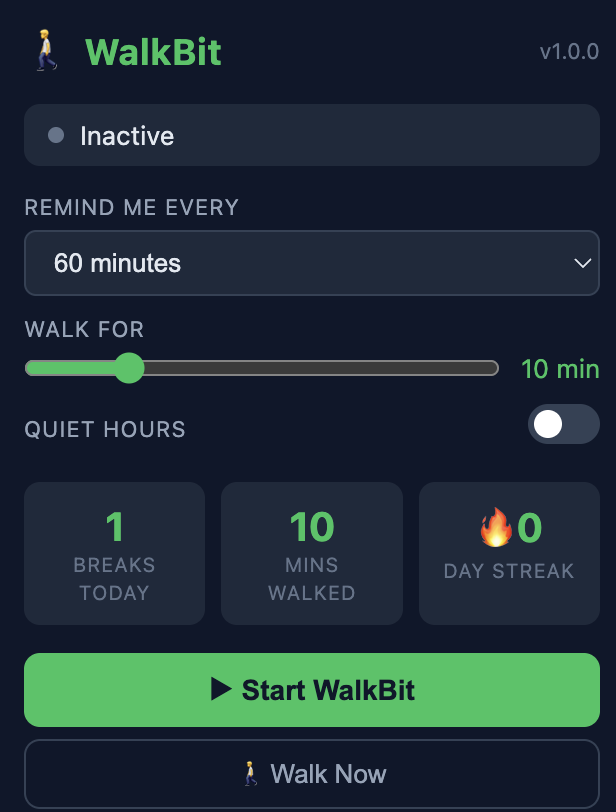
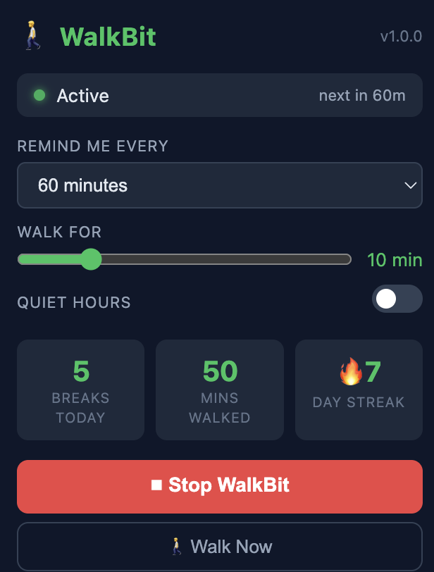
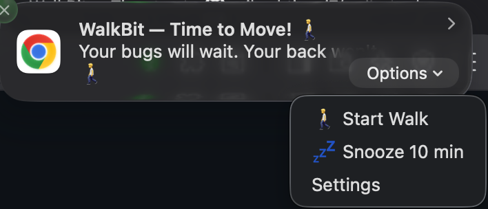

# WalkBit 🚶

> A Chrome extension that reminds folks to get up and walk. Built for people who work from home and forget to move.



## Stats after use


## Notification Panel


## Features

- ⏰ **Configurable intervals** — 15 / 30 / 45 / 60 / 90 min or fully custom (down to 1 min)
- 🚶 **Walk timer** — circular countdown (5–30 min) with rotating motivational messages
- 🎵 **Chime alert** — a gentle 3-note sound plays before every notification
- 💤 **Snooze** — 10-minute snooze directly from the notification
- 🌙 **Quiet Hours** — auto-pauses reminders during focus blocks or off-hours
- 😴 **Idle detection** — skips notification if you're already away from the desk
- 📊 **Daily stats** — breaks taken, total mins walked, day streak (🔥)
- 🎉 **Confetti** on walk completion
- 💬 Dev-humored notification messages (`sudo walk --now`)

---

## Installation (Dev Mode)

1. Clone this repo
   ```bash
   git clone https://github.com/vikashtiwari7/walkbit.git
   ```
2. Open Chrome → `chrome://extensions/`
3. Enable **Developer mode** (toggle, top-right)
4. Click **Load unpacked** → select the `walkbit/` folder
5. Pin WalkBit from the extensions toolbar
6. Click the icon, set your interval, hit **▶ Start WalkBit**

---

## ⚠️ Required: Enable Notifications

WalkBit uses browser notifications to remind you to walk. These are **off by default** on most systems.

### macOS
1. `Apple Menu` → `System Settings` → `Notifications`
2. Find **Google Chrome** (or **Brave**) in the list
3. Set **Allow Notifications** → **On**
4. Set style to **Alerts** (not Banners — Alerts stay on screen until dismissed)
5. **Disable Focus / Do Not Disturb** — `System Settings` → `Focus` → make sure no Focus mode is active, or add Chrome to the allowed apps list

### Windows
1. `Settings` → `System` → `Notifications & Actions`
2. Find **Google Chrome** → toggle **On**
3. Check that **Focus Assist** is set to **Off** (or add Chrome to priority list)

### Inside Chrome / Brave
- Go to `chrome://settings/content/notifications`
- Make sure notifications are **not blocked** globally

---

## Project Structure

```
walkbit/
├── manifest.json         # MV3 config
├── background.js         # Service worker: alarms, notifications, idle, chime
├── popup.html / popup.js # Settings UI + live stats
├── walk-timer.html / .js # Circular countdown timer + confetti
├── offscreen.html / .js  # Hidden audio context for chime playback
├── styles.css            # Shared dark-theme styles
└── icons/                # Extension icons (16, 48, 128px)
```

---

## Contributing

PRs are welcome! Open an issue first to discuss what you'd like to change.

## License

MIT © - Use it however you like
